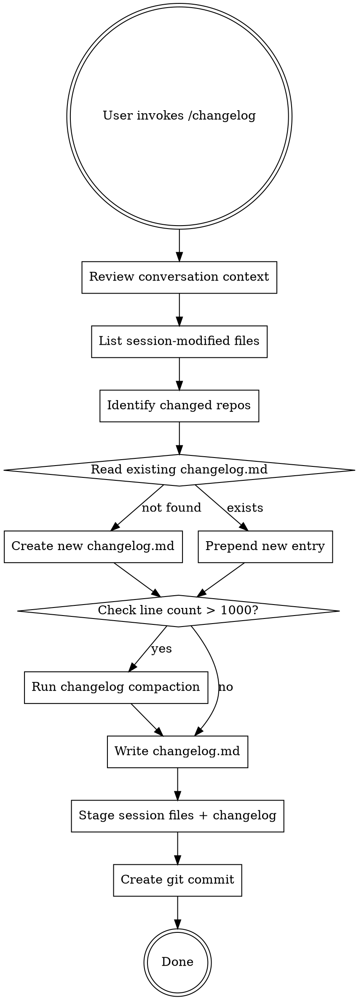

# Changelog Commit

## Overview

Record **decisions, experiments, and lessons** from the current conversation session. Code-level changes (what files changed, what parameters moved) belong in git commits, NOT here. The changelog captures what git cannot: rationale, failed attempts, experimental evidence, and open questions.

**Critical rule:** Multiple conversation sessions may run in parallel. Each session MUST only commit its own changes. Never stage or document changes made by other sessions.

## When to Use

- User invokes `/changelog`
- After a session with meaningful decisions or experiments that should be documented

## When NOT to Use

- Trivial single-line fixes — the git commit message already captures everything that matters.
- Pure refactors with no decision content — no failed approaches, no alternatives weighed.
- Routine dependency bumps or auto-format passes — those leave no lesson behind.

The cost of this skill is a commit-noise tradeoff (every changelog update produces a commit alongside the session work). Skip it when there's no "why" worth preserving.

## Changelog Location

Place `changelog.md` at the **git repository root** where changes occurred.

To determine the correct repo root:
1. Run `git -C <changed_file_path> rev-parse --show-toplevel`
2. If changes span multiple repos, update each repo's changelog separately

Place it at `<repo-root>/changelog.md`.

## Entry Format

Each entry has a date+title header and these sections. Only include sections that have content. (The compaction format uses different section names -- see Compaction section below.)

```markdown
## [YYYY-MM-DD] Short title describing the session theme

### Context
<!-- What problem or goal motivated this session? 1-3 sentences. -->

### Experiments
<!-- What was tried and what happened? Include run IDs, numerical results, -->
<!-- and WHY each approach succeeded or failed. -->
<!-- Failed attempts are especially valuable -- they prevent re-trying dead ends. -->

### Decisions
<!-- What was decided and WHY. Include alternatives that were considered -->
<!-- and the reasoning for rejecting them. ADR-style: Decision + Rationale. -->

### Open Questions
<!-- Unresolved questions for future sessions. -->
<!-- Actionable next steps if any. -->
```

### Writing Rules

1. **Date header**: `## [YYYY-MM-DD] Title` -- one section per day, merge into existing entry if same day
2. **No code diffs**: Do NOT list file-level changes (Added/Changed/Fixed/Removed). That is `git log`'s job.
3. **Experiments section**: Include specific evidence -- run IDs, metric values, iteration counts. "Failed" is not enough; explain WHY it failed so the failure is useful.
4. **Decisions section**: State the decision first, then rationale. Format: "[We decided X] because [evidence Y]." Include rejected alternatives.
5. **Be concise**: Each section should be scannable. Use bullets for multiple items. Avoid repeating information across sections.
6. **Language**: English only
7. **No AI attribution**: Do not write "Generated by AI" or similar

## Workflow



### Step by Step

1. **Review conversation context** -- Scan the current conversation for:
   - What problem was being investigated and why
   - What experiments were run and their results (run IDs, metrics)
   - What approaches failed and why
   - What decisions were made and their rationale
   - What questions remain open

2. **Identify session-modified files** -- This is the critical scoping step:
   - List all files you modified/created/deleted **in this conversation session**
   - Do NOT rely on `git diff` or `git status` alone -- they show ALL changes including from other parallel sessions
   - Cross-reference: only include files that appear in BOTH your session context AND git's changed files
   ```bash
   git status --short       # Reference only -- filter to session files
   ```

3. **Determine repo root(s)**:
   ```bash
   git rev-parse --show-toplevel
   ```

4. **Read or create changelog.md** at each repo root

5. **Write the entry** following the format above:
   - Focus on WHY and WHAT WE LEARNED, not what code changed
   - Include numerical evidence for experiment results
   - Document failed approaches with enough detail to prevent re-trying

6. **Prepend** the new entry after the file header (newest first)
   - If an entry for today already exists, **append** to it (merge sections)

7. **Check line count** -- After writing the new entry, count total lines:
   ```bash
   wc -l changelog.md
   ```
   - If **1000 lines or fewer**: skip to step 8
   - If **over 1000 lines**: run changelog compaction (see Compaction section below)

8. **Stage session files only** -- NEVER use `git add -A`:
   ```bash
   # Stage ONLY files modified in this session + changelog
   git add path/to/session-file1 path/to/session-file2 changelog.md
   git commit -m "docs: update changelog for YYYY-MM-DD session"
   ```
   - Enumerate each file explicitly from the session file list (step 2)
   - If unsure whether a file was changed by this session, do NOT stage it

## Commit Message Format

```
docs: update changelog for YYYY-MM-DD session

Summary of key changes:
- <1-2 line summary of most important changes>

Co-Authored-By: Claude <noreply@anthropic.com>
```

## Example Entry

```markdown
## [2026-04-13] Connection-pool retry strategy reverted

### Context
Investigating intermittent 500s under load: the API drops ~3% of requests once
concurrency exceeds 200. The 2026-04-10 timeout bump alone did not fix it.

### Experiments
- **Fixed exponential backoff** (commit `a1b2c3d`): retries clustered at the same
  intervals across workers, producing thundering-herd spikes. p99 latency rose 4x.
- **Jittered backoff** (commit `e4f5g6h`): smoothed the spikes but the pool still
  exhausted at 200 conns. Root cause: idle connections were never reclaimed, so
  retries competed with live traffic for the same fixed pool.
- **Pool-size profiling**: error rate tracked pool saturation (free conns 40->2),
  not retry timing. Correlation between retry count and 500s: weak (r=-0.05).

### Decisions
- **Reverted the retry-strategy change entirely.** The bottleneck is pool
  exhaustion, not retry timing; tuning backoff cannot fix a saturated pool.
- **Switched to dynamic pool sizing with idle reclamation** as the next step.
  Chose a 30s idle TTL (conservative) over aggressive reclamation to avoid churn.

### Open Questions
- Does idle reclamation alone clear the saturation, or is the upstream service the
  real ceiling? Needs a load test isolating the two.
- Backoff attempts so far (fixed, jittered) both failed. Dynamic pool sizing is next.
```

## Changelog Compaction (1000+ lines)

When changelog.md exceeds 1000 lines, compact older entries to keep the file manageable.

### Compaction Rules

1. **Preserve recent entries intact** -- Keep the last 30 days of entries untouched (full detail)
2. **Summarize older entries by month** -- Merge all entries from the same month into one `## [YYYY-MM Summary]` section
3. **Merge related experiments** -- Combine entries investigating the same problem into a single narrative with final conclusion
4. **Keep decisions and lessons** -- These are the highest-value content; never drop them during compaction
5. **Drop resolved Open Questions** -- Remove questions that were answered in later entries
6. **Preserve numerical evidence** -- Keep run IDs and key metrics even in summaries

### Summarized Month Format

```markdown
## [2026-01 Summary]

### Key Decisions
- Adopted Redis for session storage (replaced in-memory store). Validated under load test.
- Removed the custom caching layer after it caused stale reads under concurrent writes.

### Experiments and Lessons
- Migration script tuning: an off-by-one in the batch cursor caused 3 partial runs
  before diagnosis. Lesson: assert row counts before and after each batch.
- Memory leak: an unbounded event listener grew the heap across requests. Fixed by
  removing listeners on teardown (verified with a heap-snapshot diff).

### Unresolved (carried forward)
- Intermittent WebSocket disconnect under proxy timeout still undiagnosed.
```

### Compaction Step by Step

1. Count total lines: `wc -l changelog.md`
2. If <= 1000 lines, skip compaction
3. Identify the date 30 days ago from today
4. Leave all entries newer than 30 days **completely untouched**
5. Group older entries by `YYYY-MM`
6. For each month group:
   - Extract all Decisions into **Key Decisions** (deduplicate)
   - Merge Experiments into **Experiments and Lessons** narrative (keep evidence, drop redundancy)
   - Carry forward unresolved Open Questions
   - Drop experiments whose conclusions were superseded by later entries
7. Replace the old entries with summarized month sections
8. Target: final file under 800 lines (leave headroom for growth)

### Compaction Commit Message

```
docs: compact changelog older entries (YYYY-MM and earlier)

Summarized entries older than 30 days by month.
Merged related experiments and removed resolved questions.

Co-Authored-By: Claude <noreply@anthropic.com>
```

## Common Mistakes

| Mistake | Fix |
|---------|-----|
| Listing file-level changes (Added/Changed/Fixed) | Do NOT. Code diffs belong in git, not changelog |
| Writing without evidence ("it failed") | Include WHY: run ID, metric, root cause |
| Skipping failed experiments | Failed attempts are the most valuable -- they prevent repeating mistakes |
| Decisions without rationale | Always state WHY and what alternatives were rejected |
| Overwriting existing entries for same day | Merge into existing day's entry |
| Putting changelog in wrong directory | Use `git rev-parse --show-toplevel` |
| Writing in Korean | Changelog must be in English |
| Compacting recent entries (< 30 days) | Only compact entries older than 30 days |
| Dropping decisions during compaction | Decisions are highest-value; always preserve them |
| Using `git add -A` or `git add .` | NEVER -- stage only session-modified files explicitly |
| Including other session's changes | Only document changes from THIS conversation session |
