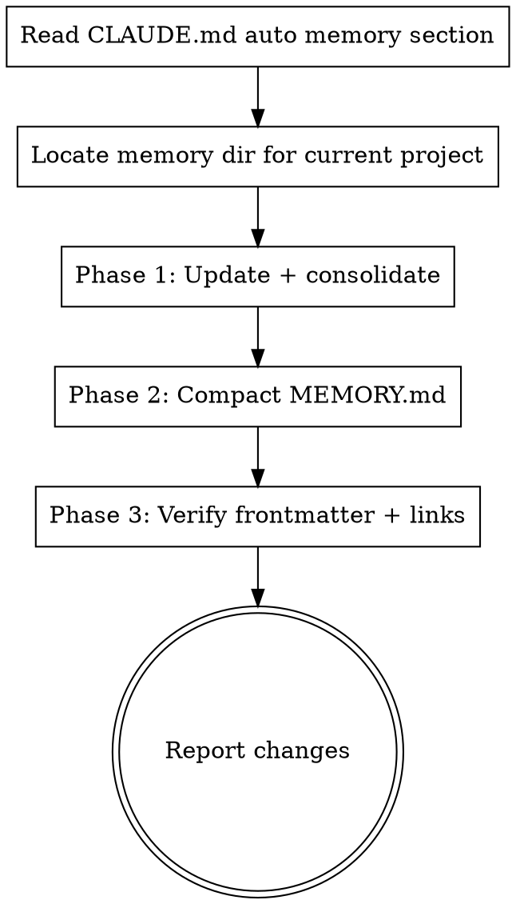

# memory-update

Compact and reorganize the auto-memory directory at `~/.claude/projects/<project>/memory/`. Auto memory is updated **automatically every conversation** by the regular CLAUDE.md mechanism — this skill is invoked only when explicit compaction is needed (MEMORY.md grows past its cap, entries duplicate, satellites need reshuffling).

## Schema SSOT — do NOT duplicate

The canonical schema for auto memory (the four types, the required frontmatter, the `**Why:**` / `**How to apply:**` body rules for feedback/project, the `[[name]]` cross-link convention, the MEMORY.md index format, the "What NOT to save" exclusions) is **provided to every conversation by the Claude Code core system prompt** under its `# auto memory` section. It is not stored in any project file. You are reading those rules right now if your runtime injects them.

**Your prior — and any future — Claude Code session already knows the schema.** This skill's job is to *apply* the schema correctly under the pressure of compaction (where duplicates pile up, satellites get orphaned, MEMORY.md grows past its cap), not to repeat the schema text. Re-stating the schema here would just risk drifting out of sync with the authoritative system-prompt version.

Before compacting, mentally re-confirm the schema from the system-prompt section — particularly:

- the four types (`user`, `feedback`, `project`, `reference`)
- the required frontmatter (`name`, `description`, `metadata.type`)
- the `**Why:**` and `**How to apply:**` lines required for `feedback` and `project` bodies
- the `[[name]]` link convention (dangling links are intentional, not errors)
- MEMORY.md as a one-line-per-entry index, ~200 line cap
- the "What NOT to save" exclusions (code patterns, git history, debug recipes, ephemeral state)

If the system prompt's section ever changes, this skill needs no update — it defers to that source. Only the operational steps below are this skill's own content.

The user-scope CLAUDE.md (`config/CLAUDE.md`) contributes one related rule (the "Compound Learnings" line under Workflow): log a one-line memory entry whenever a task surfaces something non-obvious, before ending. That is a *usage* rule for the same memory system, not a schema definition.

## When to invoke

- User runs `/memory-update`
- MEMORY.md has grown past ~150 lines and the user asks for cleanup
- User notices duplicates, stale entries, or satellite files that no longer match their CLAUDE.md slug
- After a long session that generated many new memory files, to consolidate

**Do NOT invoke for:**
- Adding a new memory entry — that happens automatically per the CLAUDE.md "auto memory" workflow; no skill needed.
- Reading a memory — read the file directly.

## Workflow



### Step 0 — Re-confirm the schema

The schema is in the Claude Code core system prompt under `# auto memory`. Skim it mentally: types, frontmatter, `**Why:**` / `**How to apply:**` lines for feedback/project, `[[name]]` links, MEMORY.md format, exclusions. No file needs to be read for this step.

### Step 1 — Locate the project's memory directory

The path is `~/.claude/projects/<project-slug>/memory/` where `<project-slug>` is derived from the current working directory's absolute path (slashes replaced with hyphens, leading dash kept). Example: `/Users/foo/bar` → `-Users-foo-bar`.

```bash
proj=$(pwd | sed 's|/|-|g')
ls ~/.claude/projects/${proj}/memory/ 2>/dev/null || echo "no memory dir yet"
```

### Phase 1 — Update and consolidate

Extract from the current conversation:
- New stable patterns, decisions, project state changes, or user preferences
- Bug fixes with lasting lessons (the *why*, not the diff)
- Architecture changes that future sessions need to know about
- Surprising or hard-won learnings that should compound

For each candidate:
1. Classify as one of the four types per the CLAUDE.md schema.
2. Check whether an existing memory file covers the same topic. **Update in place** rather than creating a duplicate.
3. If new, create a file with full frontmatter (`name`, `description`, `metadata.type`) and — for `feedback`/`project` types — the `**Why:**` and `**How to apply:**` lines in the body.
4. Add `[[other-memory-slug]]` links wherever the entry relates to or supersedes another. Dangling links are fine.

### Phase 2 — Compact MEMORY.md

**Step 2.1 — Measure**

```bash
wc -l ~/.claude/projects/${proj}/memory/MEMORY.md
```

Target: under ~150 lines (CLAUDE.md states 200 is the truncation point — leave headroom).

**Step 2.2 — Move detail out of MEMORY.md into satellites**

`MEMORY.md` is **an index**, not a memory. Each entry must be one line, `- [Title](file.md) — one-line hook`, under ~150 characters. If you find multi-line entries or inline content, that content belongs in the satellite `.md` file (with its own frontmatter), and `MEMORY.md` gets only a pointer.

**Step 2.3 — Merge duplicates**

If two satellites cover the same topic (often happens when an earlier session and a later one both wrote about a similar issue), merge: keep the more recent file, fold the older one's unique content in, update the description, delete the obsolete file, fix any `[[link]]`s that pointed to it.

**Step 2.4 — Prune entries CLAUDE.md says not to save**

Re-check each memory against CLAUDE.md's "What NOT to save" list:
- Code patterns, conventions, file paths derivable from reading the project — delete (the project state is authoritative).
- Git history / who-changed-what — delete (`git log` is authoritative).
- Debug solutions whose fix is now in the code — delete (the code is authoritative).
- Anything already in a CLAUDE.md file — delete.
- Ephemeral task state — delete.

These are valid reasons to remove a memory even if it was once worth saving.

### Phase 3 — Verify frontmatter and links

For every memory file touched:

1. **Frontmatter present and valid YAML** — `name`, `description`, `metadata.type` all set. `metadata.type` must be one of `user`, `feedback`, `project`, `reference`.
2. **Body structure** — for `feedback` and `project` types, confirm `**Why:**` and `**How to apply:**` lines exist. Without them, the schema is violated and future sessions can't judge edge cases.
3. **Link integrity** — every `[[name]]` either points to an existing memory's `name:` slug or is intentionally dangling (mark dangling in your report).
4. **MEMORY.md format** — every line either a header, blank, or `- [Title](file.md) — hook`. No multi-line entries. No frontmatter.

If any check fails, fix it before reporting done. Schema violations are the failure mode this skill exists to prevent.

## Report format

After all three phases, print:

```
## Memory Updated

**Schema source:** ~/.claude/CLAUDE.md (auto memory section)
**Project dir:** ~/.claude/projects/<proj>/memory/

**Added/Modified:**
- <slug> (<type>): <one-line reason>

**Merged (duplicates):**
- <old-slug> → folded into <new-slug>

**Deleted (per CLAUDE.md "What NOT to save"):**
- <slug>: <which exclusion rule applied>

**MEMORY.md:** <before> → <after> lines (cap ~200)
**Dangling [[links]]:** <count> (note any that should be written next)
**Schema violations fixed:** <count>
```

## Common mistakes

| Mistake | Fix |
|---|---|
| Re-defining the schema in this skill instead of deferring to CLAUDE.md | Read CLAUDE.md's auto-memory section first. This skill *applies* the schema, not defines it. |
| Compacting by truncating MEMORY.md | Move detail to satellites with their own frontmatter, leave only the one-line index entry. |
| Creating a memory without `metadata.type` | All memories must declare type. Without it, future skill invocations can't filter by type. |
| Feedback/project memory missing `**Why:**` line | The whole point of these types is to record *why* so edge cases can be judged later. Restore the why. |
| Saving derivable facts (code patterns, file paths) | Re-read the "What NOT to save" list. Memory is for non-derivable knowledge. |
| Deleting a satellite without fixing inbound `[[links]]` | grep the memory dir for the old slug before deletion; update or remove links. |

## Relationship to other memory mechanisms

- **Auto memory updates per conversation** — handled by the CLAUDE.md mechanism directly; no skill needed.
- **CLAUDE.md project rules** — different system (durable, edited by user); not touched by this skill.
- **Plans / tasks** — in-conversation persistence; do not save to memory. (CLAUDE.md says so.)
- **`changelog` skill** — records session decisions to a repo's `changelog.md`; different artifact, different purpose.
