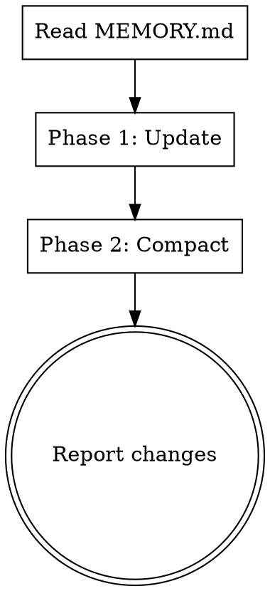

# Update Memory

Manage the auto-memory file (`MEMORY.md`) by updating it with current conversation context and compacting low-importance content into satellite files.

## Process



### Phase 1: Update

Extract from the current conversation:
- New stable patterns, parameters, or configurations
- Bug fixes with lasting lessons
- Architecture changes or file path updates
- User preferences or "do not ask again" items

For each item: check if MEMORY.md already has a related entry. **Update** existing entries rather than adding duplicates. Add new entries under the most relevant existing section, or create a new section if none fits.

### Phase 2: Compact

**Step 1 -- Measure:** Count current lines. Target: under 200 lines.

**Step 2 -- Apply category rules:**

| Always keep in MEMORY.md | Move to satellite files |
|---|---|
| Active parameters and config | Deleted file/code history |
| DO NOT ASK AGAIN items | Resolved debug history details |
| Current architecture/pipeline | Past refactoring details |
| Core math/physics formulas | Failed experiment details (keep lesson one-liners) |
| Key gotchas and traps | Code review verification logs |
| File path maps | Checkpoint compatibility details |

**Step 3 -- Apply judgment rules:**
- Remove entries duplicated in CLAUDE.md
- Compress multi-line entries into single lines where possible
- If an entry's information is fully captured by a more recent entry, remove the older one

**Step 4 -- Move:** For items moved to satellite files:
- Append to existing satellite file if topic matches, otherwise create new one
- Use descriptive filenames: `topic-name.md`
- Add a one-line reference in MEMORY.md linking to the satellite file

### Output

After completing both phases, print a summary:

```
## Memory Updated

**Added/Modified:**
- [list of entries added or changed]

**Moved to satellite:**
- [entry] -> [satellite-file.md]

**Compressed:**
- [description of compressions]

**Lines: [before] -> [after] / 200**
```
